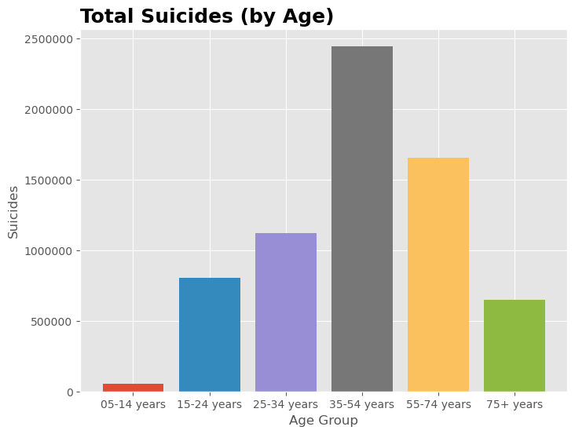

# Global Suicide Rates

***
 

## Table of Contents
- [Introduction](#introduction)
- [Data Processing](#data-processing)
- [Overall](#overall)
    - [Male vs Female](#male-vs-female)
    - [Generations](#generation-breakdown)
    - [Highest Five Countries](#high-five)
 
 
 

***
## **Introduction**
***
This dataset, which can be found [here](https://www.kaggle.com/datasets/russellyates88/suicide-rates-overview-1985-to-2016), provides global suicide rates from 1985 to 2016. This compiled dataset pulled from four other datasets linked by time and place, and was built to find signals correlated to increased suicide rates among different cohorts globally, across the socio-economic spectrum.
 
 
 

***
## **Data Processing**
***
Initial overview of data highlitedt the fact that there was some data cleaning that needed to occur.  

- Two columns were removed
    - Country Year - This appeared to be a generic code value. It was a combination of the country and year in string value. For the purposes of this analysis, it was determined it was needed.
    - HDI for year - Numerical value of for human development index. This column held a significant number of NAN values and therefore did not bring any significant value to the dataset.
- Remove 2016 data
    - Allow the data contained data from 2016 it appeared that this data may have been gathered at some point in 2016 as there was only 160 (of 27820) data points for this particular year
- Remove Countries with less than 3 years of data
    - In order to properly assess the suicide data for a particular country it was determined that there should be at least 4 years of data in order to be considered significant.
    - The following countries were removeds: 7 Countries - Bosnia and Herzegovina, Cabo Verde, Dominica, Macau, Oman, Saint Kitts and Nevis, San Marino.

***
## **Overall**
***
 **Key Highlights**   
- Data spaned across **93** different countries
- Peak rake was in **1995** with **15.66** per 100K
- Average rate from 1995 to 2015 was **12.87** deaths per 100K
- Steady decrease from 1995 to 2015  

The dataset consited of over 27000 records, Which included 100 different countries. An inital cursory look at the data can be seen below. It appeared that global suicide rates continued to increase until its peak in 1995 with an average of 15.66 suicides per 100,000 people. After which there was a steady decline. Additionaly, the average rate per 100K people was 12.87 suicides.

Of key note is the high point in 1995, which begs the questions what occured or led to this point. A quick look into history revealed there were several world events that could have led to things like survivors remorse or affected by the losses or events themselves.  

 **Global Events Included:**   
Oklahoma City Bombing, US pulls out of Somalia, UN intervenes in Bosnian Civial War, Japan Earthquake, UK Barings Bank Collapse, Russian Earthquake, OJ Found Innocent

 
 
 

### Male vs Female
 **Key Highlights**   
- Max male rate of **24.90** per 100K
- Max female rate of **6.42** per 100K
- Male suicide rate is **3.8** times higher than that of females

 
 

### Generation & Age Breakdown
 **Key Highlights**   
- Generation agnostic
- **35-54** age group has the most amount of suicides
    - **1.48** times higher than the next highest age group

 
 

 
 

### High Five
 **Key Highlights**   
- Country count can be minscontrued due to large populations
    - Per 100K data is a better representation
    - **Ukraine** appears to be an outlier due to it's size (**16** smaller than the United States)  
    **8931.66** suicides per 100K, compared to the United States at **5140.97**
- **Eastern European** (Former Soviet Block Countries) appear to have a higher propensity for suicide

